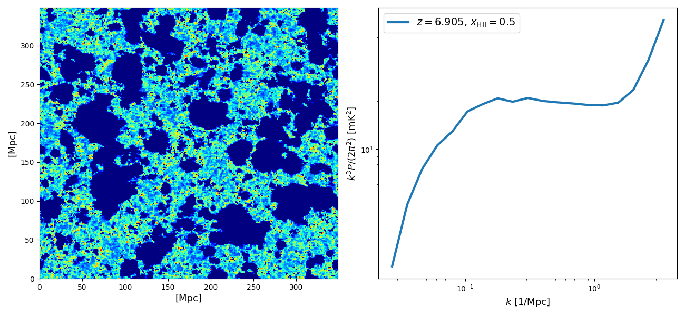
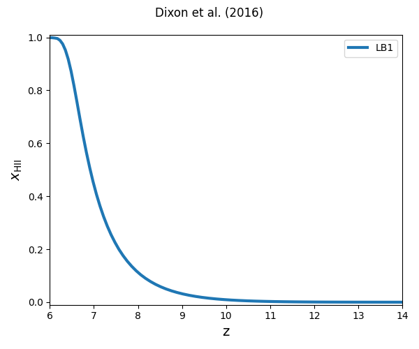

# StoReS

Storage of Reionization Simulations

## Package details

The package provides methods for retrieving simulations of reionization and cosmic dawn.

## INSTALLATION

One can install a stable version of this package using pip by running the following command::

    pip install StoReS

In order to use the latest version, one can clone this package running the following::

    git clone https://github.com/sambit-giri/StoReS.git

To install the package in the standard location, run the following in the root directory::

    python setup.py install

In order to install it in a separate directory::

    python setup.py install --home=directory

One can also install it using pip by running the following command::

    pip install git+https://github.com/sambit-giri/StoReS.git

The dependencies should be installed automatically during the installation process. If they fail for some reason, you can install them manually before installing StoReS. The list of required packages can be found in the requirements.txt file present in the root directory.

### Tests

For testing, one can use [pytest](https://docs.pytest.org/en/stable/) or [nosetests](https://nose.readthedocs.io/en/latest/). Both packages can be installed using pip. To run all the test script, run the either of the following::

    python -m pytest tests
    
	nosetests -v

## USAGE

Script to get C2Ray reionization simulations.

```python
import numpy as np 
import matplotlib.pyplot as plt 
import pickle
from glob import glob
from StoReS import * 
import tools21cm as t2c 

box_len  = 244/0.7
save_dir = '../../'

xf_url = 'https://ttt.astro.su.se/~gmell/244Mpc/LB1/'
dn_url = 'https://ttt.astro.su.se/~gmell/244Mpc/densities/nc250/coarser_densities/'
url_dict = {'dens': dn_url, 'xfrac': xf_url}

c2r = C2RAY(work_dir=save_dir)
c2r.set_links(url_dict)
z = 6.905
data = c2r.get_data_z(z)
xf = data['xfrac']
dn = data['dens']


fig, axs = plt.subplots(1,2,figsize=(13,6))
dt = t2c.calc_dt(xf, dn, z)
ps, ks = t2c.power_spectrum_1d(dt, kbins=20, box_dims=box_len)
axs[0].pcolormesh(np.linspace(0,box_len,dt.shape[0]+1), 
                  np.linspace(0,box_len,dt.shape[1]+1), 
                  dt[:,:,0],
                  cmap='jet')
axs[0].set_xlabel('[Mpc]', fontsize=13)
axs[0].set_ylabel('[Mpc]', fontsize=13)
axs[1].loglog(ks, ps*ks**3/2/np.pi**2, lw=3, 
    label='$z={:.3f}$, $x_\mathrm{{HII}}={:.1f}$'.format(z,xf.mean()))
axs[1].legend(fontsize=14)
axs[1].set_xlabel('$k$ [1/Mpc]', fontsize=13)
axs[1].set_ylabel('$k^3 P/(2\pi^2)$ [mK$^2$]', fontsize=13)
plt.tight_layout()
plt.show()

```



Script to get (re)ionization history of the LB1 simulation from Ref. [[1]](#1).

```python
import numpy as np 
import matplotlib.pyplot as plt 
import pickle, os
from glob import glob
from StoReS import * 
import tools21cm as t2c 
from tqdm import tqdm 

box_len  = 244/0.7
save_dir = '../../'
eor_hist = {}

xf_url = 'https://ttt.astro.su.se/~gmell/244Mpc/LB1/'
dn_url = 'https://ttt.astro.su.se/~gmell/244Mpc/densities/nc250/coarser_densities/'
url_dict = {'xfrac': xf_url, 'dens': dn_url, }
c2r = C2RAY(work_dir=save_dir)
c2r.set_links(url_dict)
zs = np.intersect1d(c2r.zs_dict['xfrac'], c2r.zs_dict['dens'])
xs = []
for i,z in tqdm(enumerate(zs)):
    # z = 6.905
    data = c2r.get_data_z(z)
    xf = data['xfrac']
    dn = data['dens']
    xs.append(xf.mean())
    os.remove(data['xfrac_filename'])
    os.remove(data['dens_filename'])
xs = np.array(xs)
eor_hist['LB1'] = {'z': zs, 'x': xs}

fig, ax = plt.subplots(1,1,figsize=(6,5))
fig.suptitle('Dixon et al. (2016)')
ax.plot(eor_hist['LB1']['z'], eor_hist['LB1']['x'], lw=3, label='LB1')
ax.set_xlabel('z', fontsize=14)
ax.set_ylabel('$x_\mathrm{HII}$', fontsize=14)
ax.legend()
ax.axis([6,14,-0.01,1.01])
plt.tight_layout()
plt.show()
```



## CONTRIBUTING

If you find any bugs or unexpected behavior in the code, please feel free to open a [Github issue](https://github.com/sambit-giri/StoReS/issues). The issue page is also good if you seek help or have suggestions for us. 

## References
<a id="1">[1]</a> 
Dixon, K. L., Iliev, I. T., Mellema, G., Ahn, K., & Shapiro, P. R. (2016). The large-scale observational signatures of low-mass galaxies during reionization. Monthly Notices of the Royal Astronomical Society, 456(3), 3011-3029. [arXiv:1512.03836](https://arxiv.org/abs/1512.03836).
